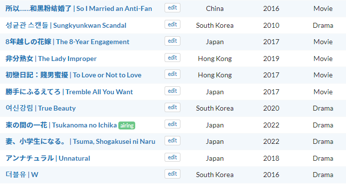

# MyDramaList Native Titles

Displays the native name on titles of dramas and of staff on [MyDramaList](https://mydramalist.com/).

[**Install**](https://github.com/MarvNC/mydramalist-native-titles/raw/master/mydramalist-native-titles.user.js)

(I recommend using [ViolentMonkey](https://violentmonkey.github.io/) to install userscripts.)

_-_MyDramaList_-_httpsmydramalist.com_2022-11-22_13-47-59.png>)
_-_MyDramaList_-_https_2022-11-22_13-49-34.png)